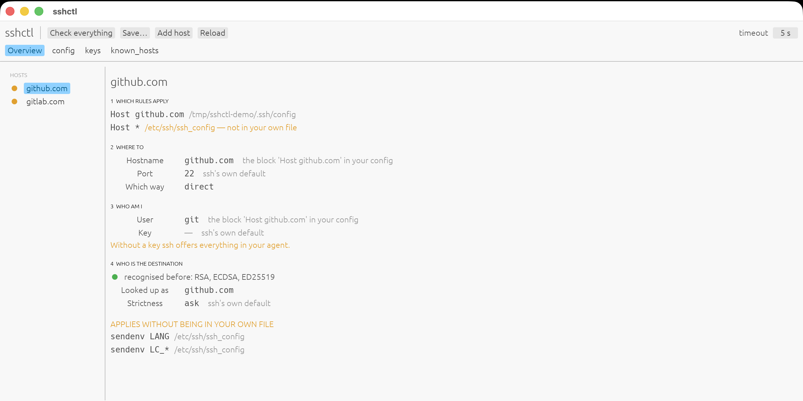

# sshctl

[](https://github.com/RyGe87/sshctl/actions/workflows/ci.yml)
[](https://github.com/RyGe87/sshctl/releases)
[](LICENSE)

Show, check and update your SSH configuration, tidied up — with a CLI and a
window on the same core.

## Why

A `~/.ssh/config` is not hard to write. The problem is that it quietly starts
lying. Machines disappear, keys get revoked, a block points at a file that is
no longer there — and nothing tells you. You only notice once you have spent
half an hour staring at a `Permission denied` that says nothing about *which*
key was refused.

## One file

`~/.ssh/config` is the single source of truth. sshctl reads it in, keeps a
working copy in memory, and writes it back.

There is deliberately no second configuration file. That saves a whole class of
problems: as soon as there is both a source and an output, something has to
keep watch permanently over which of the two is right, and you end up with
messages like "exists but is not mine".

During a session there *is* a **working copy** in
`~/.config/sshctl/working-copy.toml` — a snapshot of what is in memory, to look
at or to diff. It gets written but never read back, and it is wiped both on
startup and on exit. That way the question "which of the two is the right one"
cannot arise: outside a running session only one file exists. If something is
left behind after a crash, the next start throws it away.

## Is rewriting safe? Ask ssh, do not guess

Because sshctl writes back over a file that *you* own, the question before
every save is: does anything change about what happens when you connect?

Comparing the text cannot answer that. It gets it wrong in both directions.
`Port 2222 # the odd port` becoming `Port 2222` looks like a loss and is not —
ssh lands on 2222 either way. And a rewrite that keeps every single line can
still change which block matches first, which is a real change nothing in the
text shows.

So sshctl proves it instead. Both versions go to a temporary file, and
`ssh -G -F <file> <name>` is asked about every name that matters. That output
is ssh's own fully-resolved configuration, after `Host` patterns, `Match`,
`Include` and its built-in defaults. Identical for every name means the rewrite
changes nothing.

Two things it deliberately does not do:

- It says **nothing about comments**. `ssh -G` never reports them, so those are
  checked separately as text. A lost comment is a note, not a refusal: nothing
  breaks, but you should know.
- It does **not invent an answer**. If ssh cannot be asked, or if an `Include`
  or a `Match exec` disappears — both bring in behaviour this file cannot show
  — the verdict is "could not prove anything", and that blocks the write just
  as a real difference would. Not having checked is not the same as having
  checked.

A proof is only as strong as the names it probes, so those are read out of both
texts as well as the model. A `Match host beta` block mentions `beta` nowhere
else; without that, deleting the whole block came out as "nothing changed".

`Match` and `Include` are not rewritten but passed through **exactly where they
stood**. Position is part of what they mean: an `Include` pulls its file in at
that spot and the first value wins, and a `Match` applies to everything after
it.

Alongside this there is still a plain text check that lists what the parser did
not hold on to. It is useful to look at; it is no longer what decides.

## `config` and `known_hosts`

They are opposite files. `config` is **what you want**: you write it, ssh reads
it before connecting. `known_hosts` is **what you have seen**: ssh writes it
afterwards, and it is the only protection against a machine passing itself off
as yours.

They are tied together through `HostName`, not through your alias. `unraid`
sits in the ledger as `192.0.2.10`. Change the `HostName` and the machine is
suddenly unknown and you get a trust prompt all over again — with the old entry
left behind forever.

**The path to `known_hosts` is never invented by us.** Next to it there is
often a `known_hosts.old` that `ssh-keygen -R` leaves behind, with revoked keys
in it. Anyone globbing on `known_hosts*` reads quiet nonsense. That is why
sshctl asks `ssh -G` which files really apply.

The comparison happens **per name and not per key**: one machine usually has an
RSA, an ECDSA *and* an Ed25519 key, and it is enough for one of them to belong
to a known host. And an entry with the same fingerprint as a known host is not
an unknown machine but the same machine under a different name — that gets
reported as a duplicate, not as an orphan.

## What the doctor checks

Three layers, each one only if the previous one succeeded. That way a dead host
costs one timeout and not three.

1. **The file** — does the key exist, are the permissions not too wide, is the
   public half present, is there a passphrase on it.
2. **The network** — does the hostname resolve, does the port answer.
3. **The login** — does the host really accept this key.

Plus the ledger: hosts that have never been recognised, entries that no host
points at any more, and machines that sit in `known_hosts` under several names.
On top of that: keys that no host uses, and clutter in `~/.ssh`. Exit code 1 as
soon as something is really broken, so you can hang this in a cron job or a
watchdog.

### Two traps that are deliberately covered here

**A host without an `IdentityFile`.** ssh then offers everything in your agent,
fails after a few attempts, and reports "Permission denied" without saying
which key it tried. This is the most expensive mistake to find by hand, so the
doctor warns about it.

**A host without a shell.** GitHub authenticates fine but refuses to run
commands, so the test command fails while the key does work. Going purely by
the exit status would report GitHub as broken; `classify_login` therefore looks
at the error message.

## Install

Prebuilt binaries are on the
[releases page](https://github.com/RyGe87/sshctl/releases): macOS (universal,
with a ready-made `sshctl.app`), Linux (x86_64) and Windows (x86_64), each
archive holding both the CLI and the GUI. The macOS app and binaries are
signed with a Developer ID and notarized by Apple, so they open like any
other program.

Homebrew is the short route:

```sh
brew install ryge87/tap/sshctl           # CLI + GUI binaries
brew install --cask ryge87/tap/sshctl    # the macOS app, into /Applications
```

Linux and Windows have no notary, so those artifacts carry the honest
equivalent: a build-provenance attestation.
`gh attestation verify <file> --owner RyGe87` proves a download was built
from this repository by GitHub's own runners, and `SHA256SUMS` lists every
checksum.

With Rust installed there is also `cargo install sshctl`, which builds both
binaries from source.

## Usage

```sh
sshctl list                  # short table of your hosts
sshctl show                  # your config tidied up, the way write saves it
sshctl write --dry-run       # the difference, without writing
sshctl write                 # write, with a backup as config.before-sshctl
sshctl doctor                # check everything
sshctl explain unraid        # what really applies, and where it comes from
sshctl add work --hostname work.example.com --user you --generate-key
```

## `explain`: the file proposes, ssh decides

A config is not a list of settings but a procedure. `explain` shows that
procedure for one host: which blocks apply, where the connection goes, and as
whom you knock — with, for **every value, where it comes from**.

The values come from `ssh -G`, so from OpenSSH itself, after all patterns,
`Match` blocks, `Include` files and built-in defaults. sshctl does not redo
that sum; one subtle difference and the display would lie. What sshctl adds is
the provenance, by laying its own parse next to it.

That is also how `explain` sees things you will not find in any file of your
own. On macOS, `/etc/ssh/ssh_config` for instance sets `SendEnv LANG LC_*` for
*every* connection; that shows up under "applies without being in your own
file".

## A setting stays where it stands

sshctl does **not** pull per-host settings together into a shared `Host *`.
That looked tidier and was the first version, but it changes the meaning: a
host without an `IdentityFile` that inherits `IdentitiesOnly yes` then offers
no key at all and can no longer log in.

Only a `Host *` block that was already there fills in the shared settings.

The key is always called `id_ed25519_<alias>`. That rule lives in the code and
not in your head, so key and host can no longer drift apart.

## The GUI



```sh
./bundle-app.sh --install     # puts sshctl.app in /Applications
```

After that you start it from Spotlight. The window has four tabs, and the
guiding rule is that **the first tab is for looking, the other three are for
changing**:

- **Overview** — every host as **the stages of a connection**: which rules
  apply, where to, which way, as whom, trust, encryption, and what happens
  afterwards, with behind every value where it comes from. The later stages
  stay collapsed as long as everything is ssh's own default, so an ordinary
  host takes a few lines and a complicated one points you straight at where the
  complication sits. Nothing here changes your files.
- **config** — add, edit and remove hosts; pick extra options by intent
  ("I want reopening to be faster" leads you to `ControlMaster`) instead of by
  name.
- **keys** — *all* private keys in `~/.ssh`, not only the problems. A key no
  host uses can become a host in one click, and you can make or remove a key
  from here.
- **known_hosts** — the ledger next to your config: show an entry, remove one,
  or add one after checking its fingerprint.

The check runs the moment you open it — when you open the lid you want to know
how your network is doing, not go looking for a button first.

Saving first shows the difference, and then asks `ssh -G` two separate
questions — in the background, while the window stays alive. *Does the rewrite
itself change anything?* is the safety gate: a difference there blocks, with
an explicit override. *What do your own edits change?* is information you
asked for by editing: it is listed, and one click writes it. Keeping the two
apart is what saves the alarm from crying wolf on every deliberate edit. It
also warns if the file has changed outside the app in the meantime, and puts
a backup next to the original.

Two things that determine the shape:

- **The slow work runs on separate threads** and trickles in: the checks, the
  reading of the ledger, and the `ssh -G` proof behind the save screen. One
  dead host costs seconds; the window must not look frozen for that long.
- **The GUI holds no logic of its own about ssh.** Everything comes from the
  same library as the CLI, so the two shells cannot possibly drift apart.

One detail that might surprise you: the status dots are drawn rather than set
as a character. The round symbols `●` and `○` are missing from egui's default
font and would show up as empty boxes.

## Building

```sh
cargo build --release        # both binaries: sshctl and sshctl-gui
cargo test                   # all of them in the library
```

Structure: `src/lib.rs` is the core, with `parser` (config → model),
`generate` (model → config), `proof` (does ssh still do the same thing?),
`fidelity` (which lines does the parser not hold on to?), `keys` (which key
belongs to which host), `known` (the ledger), `pattern` (Host patterns),
`catalog` (the settings you can pick), `proxy` (jump chains), `effective`
(`ssh -G` + provenance) and `doctor`. `src/main.rs` is the CLI,
`src/bin/sshctl-gui.rs` the GUI.

```text
  ~/.ssh/config  --parser-->  Source  --generate-->  ~/.ssh/config
        |               \                  /               |
        |                `-- fidelity ----'                 |
        |                                                   |
        `------------------ proof: ssh -G ------------------'
                     (do both give the same answer?)
```

## Requirements

The `ssh` and `ssh-keygen` binaries on your `PATH` — sshctl leans on them for
the truth rather than reimplementing it. OpenSSH 8.2 or newer is best; on
anything older the algorithm check cannot run and says so instead of skipping
silently. It is written to be portable (Linux, macOS, Windows), but so far only
macOS has been run in anger; the notes in the source mark what still needs
checking elsewhere.

## Status

Version 0.1: it does what it says and every fix carries a test, but it has not
yet been through many hands. Treat `write` with the healthy suspicion it treats
your file — there is always a backup as `config.before-sshctl`, and it refuses
to write when it cannot prove the connection is unchanged.

## Built with Claude

This project is a collaboration between Geert Rymenants and Claude,
Anthropic's LLM. The first working version was written together with Claude
Opus 5. Claude Fable 5 then took the codebase through a full review and fixed
what it found — a parser that quietly moved comments onto the wrong host, a
doctor that could report a false "OK" on an error it did not recognise, a
save gate in the GUI that judged by stale data — and went on to restructure
the save flow into its two separate questions, move the proof and the ledger
onto background threads, parallelise the `ssh -G` probes, and teach the
parser quoted `Host "my server"` patterns. Every fix carries a test, and
every commit names its co-author.

## License

MIT — see [LICENSE](LICENSE).
